# Developing Online Music Store.

A full stack online music store, containing administrative features and full user functionality to add purchases to account cart and checkout.

## Features

	- Modern Bootstrap styling
	- Uses JS to handle events
	- JSP
	- SpringBoot MVC
	- Spring Security
	- MySQL database

## Installation

	- Clone and pull source code from provided github repository
	- Run spring project and naviagate to localhost:8080/home on desired browser.

## Code

	https://github.com/nicholas-auyeung/Developing-Online-Music-Store

## Flow

1. Create all object entitys.

2. Create all DAO and service operations.

3. Implement controllers.

4. Test data flow.

5. Add administrative features.

6. Apply html formatting and Bootstrap css.

## Usage
Once the user has accessed the home URI, localhost:8080/home
	
	The home page will be displayed with an image carasoul and navigation bar.

	Click the 'Register' link on the navigation bar to view the menu.
	The user will be brought to a registration form page.
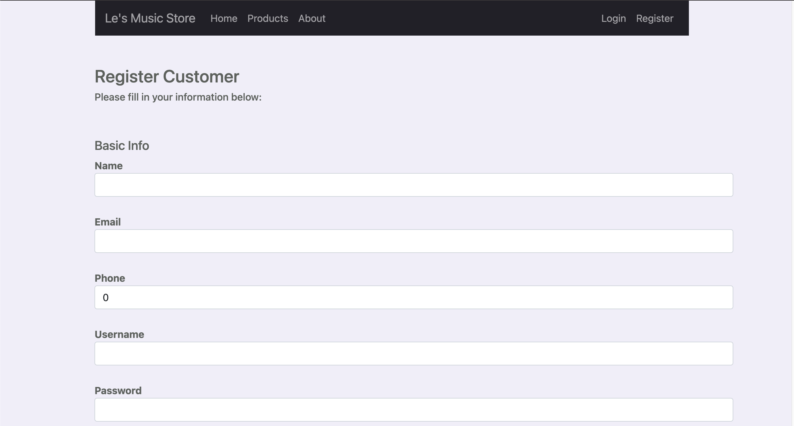
	
	On success the user will be prompted with a registration success message.
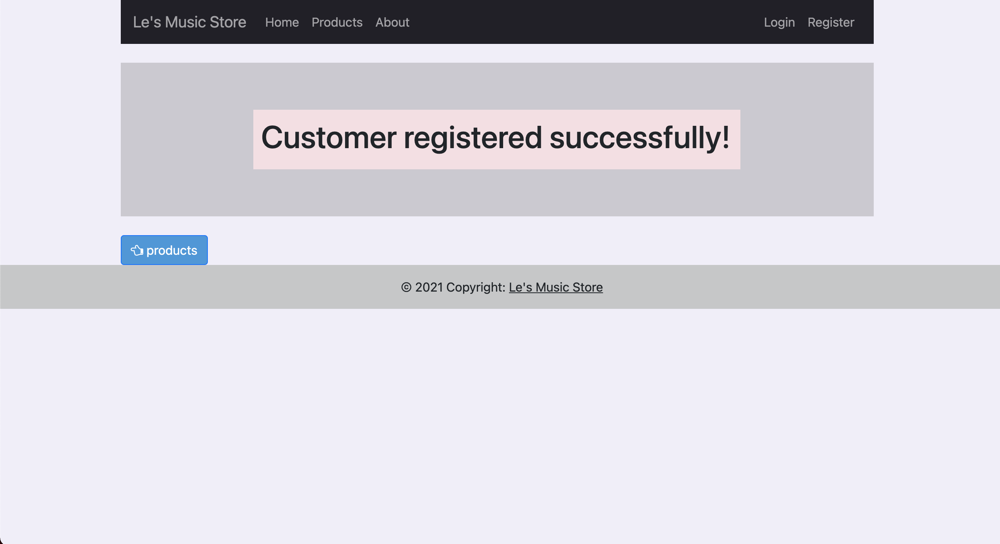

	Now the user can login.
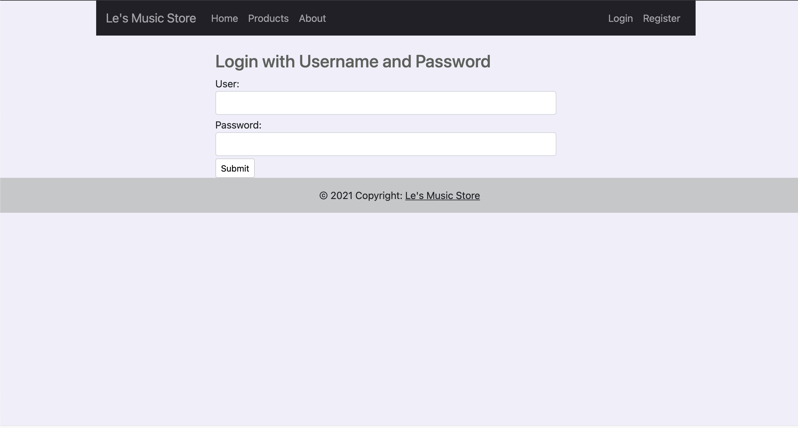

	On success the user will be brought to the user home page.

	Click the 'Products' link on the navigation bar to view the products.
	The user will be brought to a product page.
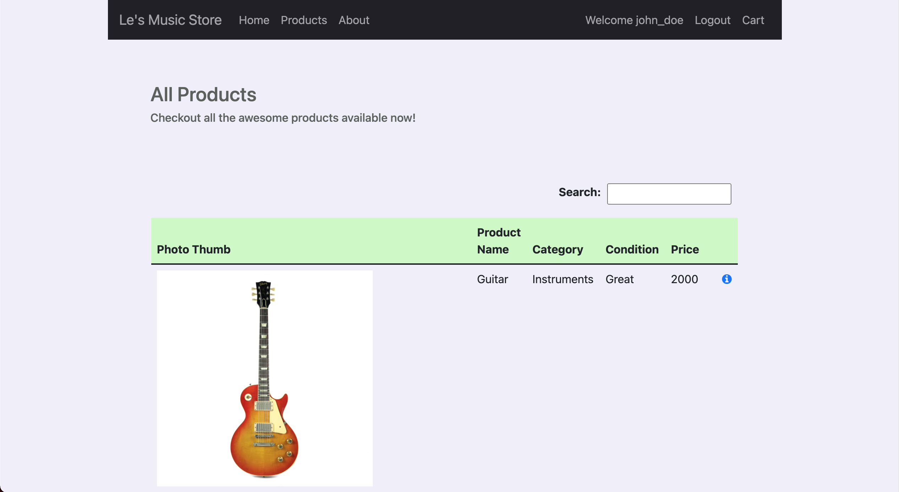

	The user can click the 'i' icon to view more details about the product.
	Clicking 'Order Now' will add the item to your cart.
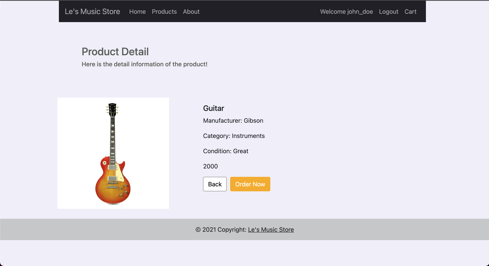

	Click the 'Cart' link on the navigation bar to view the cart.
	The user will be brought to the cart page.
	There is a red 'clear cart' button to remove all items from the cart, and individual red 'remove' buttons to remove 1 quantity of a specified product.
	If user is satisfied with cart, click 'checkout' to proceed with placing the order.
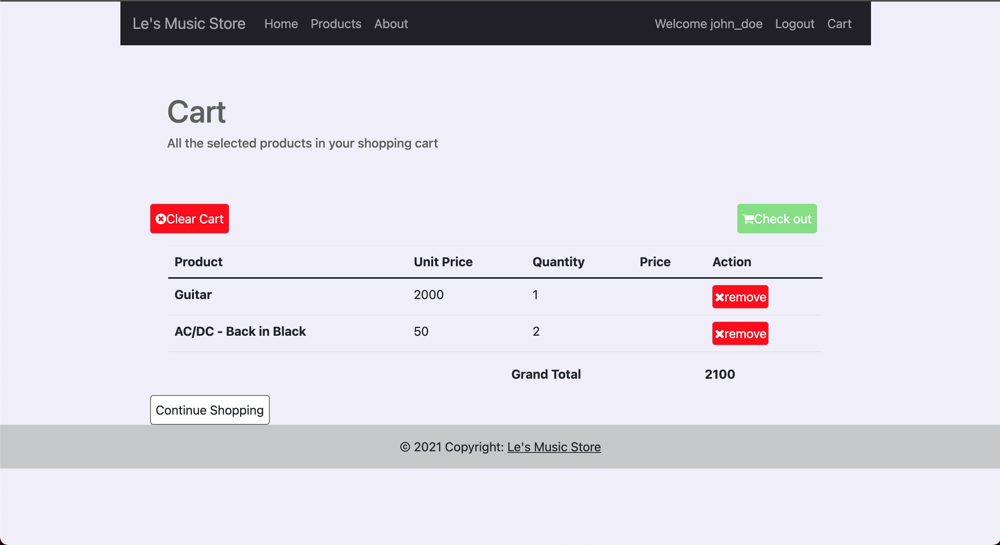

	User will be redirected to a 'Customer Detail' form to confirm their name and address details.
	Clicking 'next' after confirming customer details will bring the user to the order confirmation page.
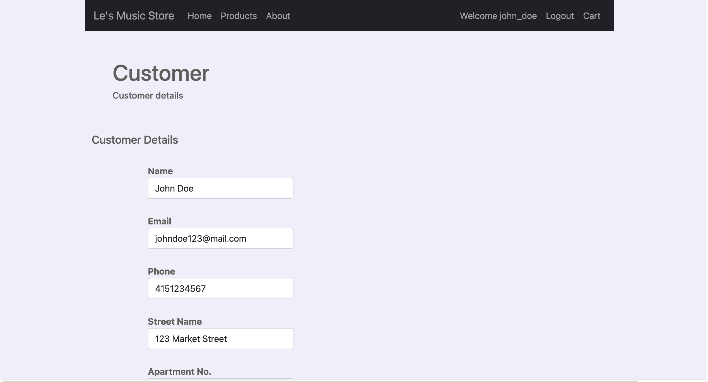

	The order confirmation page will display the order confirmation details and allow the user to confirm and place the order.
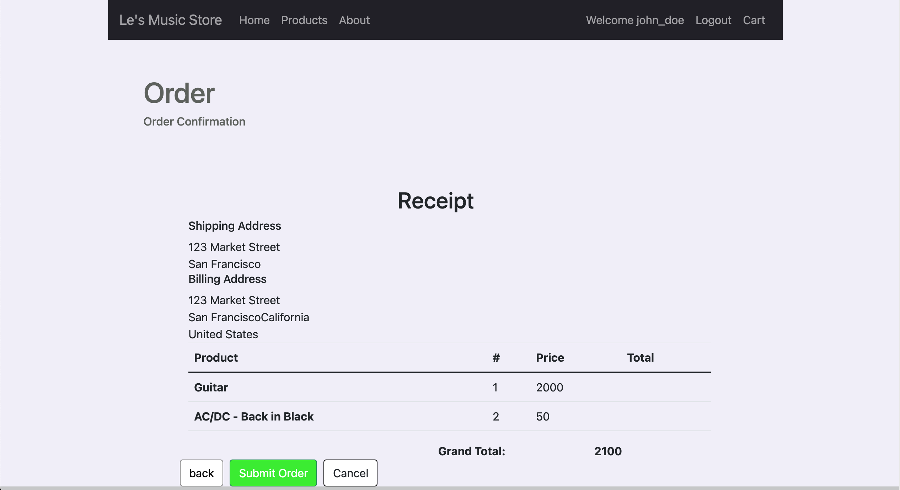
	
	On success the user will be brought to an order success page.
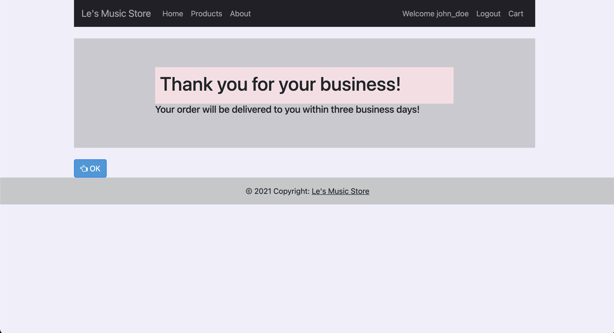

	The user can logout or continue to make purchases.
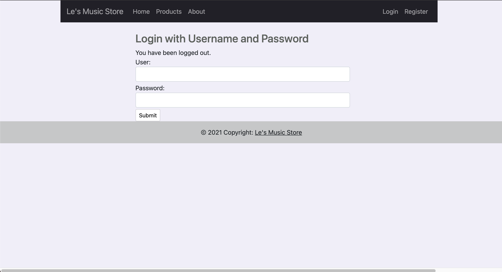

Admin Usage

On start of the application a default admin account is created with the username 'admin' and password 'admin'.

	Once logged in as admin the admin will be brought to the admin home page.
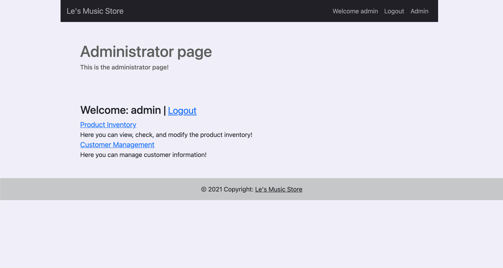

	The admin can click on the 'Product Inventory' hyperlink to add, edit and manage the products.
	Clicking 'i' icon will allow the admin to preview the product details page for the specified product.
	Clicking 'X' icon will allow the admin to delete the specified product.
	Click the pencil icon will allow the admin to edit the specified product.
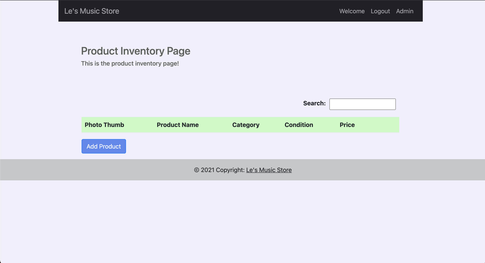

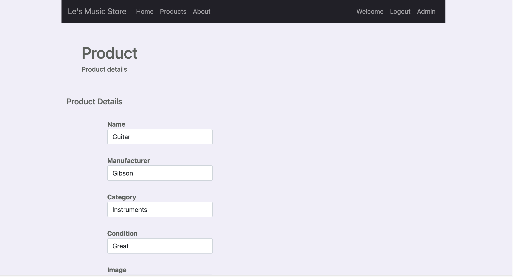
	
	Click the 'Add Product' button to add a product.
	The admin will be brought to a new product form.
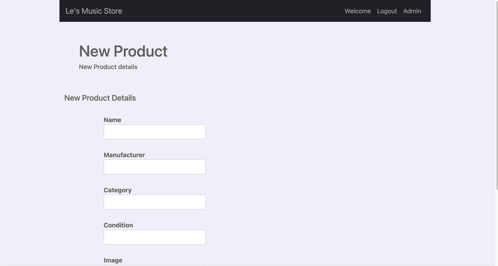

	If the admin clicks the 'Customer Management' hyperlink in admin home
	The admin will be brought to the customer management page where they can view all user credentials.
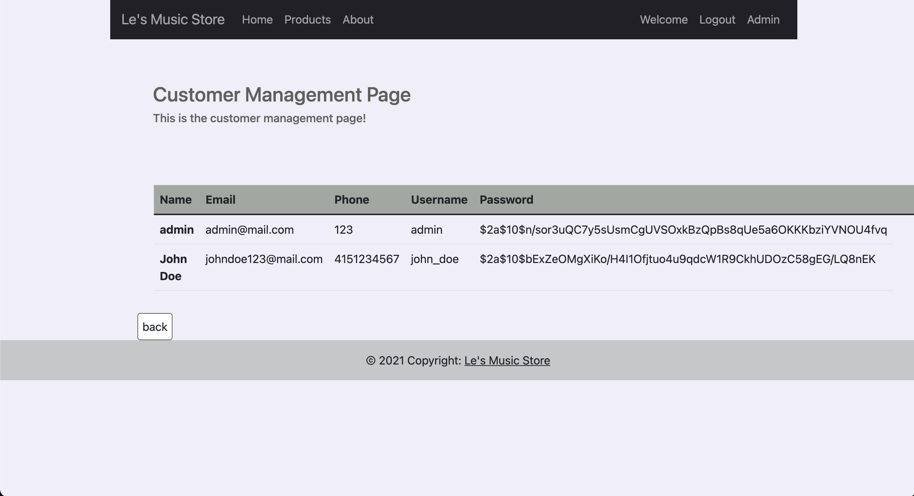
